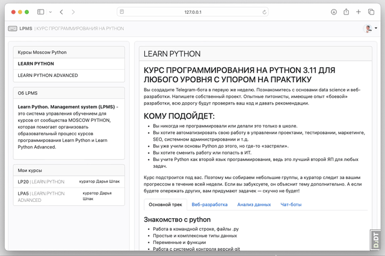
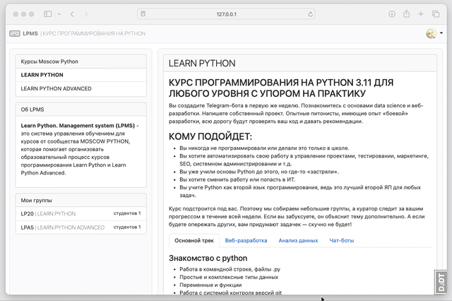

# Learn Python. Management system (LPMS)

> Настоящий проект реализуется в рамках подготовки итоговой выпускной работы студента набора LPA5 курса Learn Python Advanced

LPMS - Это система управления обучением для курсов от сообщества MOSCOW PYTHON, которая помогает организовать образовательный процесс курсов программирования Learn Python и Learn Python Advanced. 

## Возможности LPMS:

- Создание и управление курсами
- Управление доступом к материалам курса
- Мониторинг успеваемости
- Интеграция с хостингом проектов (для сдачи домашних заданий)
- Гибкая система настройки курсов и учебных планов
- Сбор и анализ статистики обучения
- Автоматизация процессов управления обучением

## Скриншоты:

### Авторизация и профили
> доступно Студенту, Куратору и Анонимному пользователю

| Курсы      | GitHub Oauth  |  Профили  |
|------------|---------------|-----------|
|| ||

#### Профиль Студента

| Список задач | Канбан задач  |
|--------------|---------------|
|| |

### Обучение

#### Дашборд материалов обучения
> доступно Студенту и Куратору

| Недели      | Контент  |
|-------------|----------|
|| |

#### Дашборд Студента

| Список задач | Выполнение задачи |
|--------------|-------------------|
|| |

#### Дашборд Куратора

| Список ревью | Список студентов  |
|--------------|-------------------|
|| |

## Журнал разработки

### Переменные окружения
| Название переменной | Назначение / Валидные значения |
|---------------------|--------------------------------|
| **Основные**        |                                |
| `DEBUG`             |`True` или `False`              |
| `ALLOWED_HOSTS` | Хосты/доменные имена через запятую, которые являются допустимыми для данного сайта. Например: `127.0.0.1,localhost` |
| **GitHub OAuth**    |                                |
| `GITHUB_OAUTH_CLIENT_ID` | `Client ID` для вашего приложения на GitHub [OAuth Apps](https://github.com/settings/developers) |
| `GITHUB_OAUTH_SECRET` | `Client secrets` для вашего приложения на GitHub [OAuth Apps](https://github.com/settings/developers) |
| `GITHUB_OAUTH_REDIRECT_URL` | `Authorization callback URL` для вашего приложения на GitHub [OAuth Apps](https://github.com/settings/developers) |
| **GitHub API** (*опционально*) |                    |
| `GITHUB_API_TOKEN` | [`Personal access tokens (classic)`](https://github.com/settings/tokens) вашего аккаунта GitHub. Позволяет увеличить часовой лимит запросов от приложения к GitHub c 60 до 5000. Используется в задачах автокомплита пулл-реквестов и последующей сверки статуса ревью. |

### Включены зависимости

- основные в [requirements.txt](requirements.txt)
- для разработки в [requirements_dev.txt](requirements_dev.txt)

| Библиотека           | Назначение                                  |
|----------------------|---------------------------------------------|
| [Django](https://www.djangoproject.com) | бэкенд, фронтенд |
| [django-debug-toolbar](https://github.com/jazzband/django-debug-toolbar/tree/main) | отладка | 
| [django-import-export](https://github.com/django-import-export/django-import-export/tree/main) | пакетный импорт/экспорт контента из админки |
| [django-allauth](https://github.com/pennersr/django-allauth) | авторизация через GitHub OAuth |
| [markdown](https://github.com/Python-Markdown/markdown) | рендер html из markdown в тепмлейтах |
| [PyGithub](https://github.com/PyGithub/PyGithub) | GitHub API враппер                          |
| [flake8](https://github.com/PyCQA/flake8) | проверка стилей |
| [mypy](https://github.com/python/mypy) | проверка типов |

### Журнал версий

#### Задачи
- [ ] GithubApi
  - проверка аппрувов для Ревью Кураторов
- [ ] Добавить приложение Notify
  - добавить мастер-канал для уведомлени Студентов и Кураторов
  - добавить Телеграм-бота в качестве провайдера уведомлений
  - добавить уведомления студенту для аппрувленных тасков от кураторов
  - добавить уведомления куратору для новых тасков от студентов
  - добавить уведомления студенту о новых материалах по курсу  
- [ ] Дашбоард куратора
  - форма ревью работы студента
  - доски: успеваемость
- [ ] Деплой
  - завернуть проект в докер образ
  - арендовать vds
  - развернуть проект из докер образа на сервере
  - купить домен
  - подключить домен к серверу
- [ ] Настроить CD
  - настроить Github Action для сборки и доставки докер образа на сервер  
- валидатор для формы добавления пулл-реквеста
- редизайн админки

#### 0.3 (ветка [dev](https://github.com/mmmylnikov/lpms/tree/dev))

- [+] Настроен CI
  - настроен [Github Action](.github/workflows/django_ci.yml) для Flake8 и Mypy
- [+] Оптимизированы запросы к бд в темплейтах:
  - лендинг
  - профили
    - студент
    - куратор
  - дашборд
    - студент (уроки и задания недели)
    - студент (выполнение задачи)
    - куратор (студенты и ревью)
- [+] Добавлена утилита [GithubApi](lpms/user/utils.py)
  - возвращает список репозиториев пользователя
  - возвращает список пулл-реквестов по репозиторию
- [+] Дашбоард студента
  - добавлена вьюха [автокомплита](https://github.com/mmmylnikov/lpms/blob/df3f70faaeb48fe082067f66af3576227d6f6795/lpms/dashboard/views.py#L163-L188) репозиториев/пулл-реквестов из github-аккаунта для формы добавления домашней работы 
  - студент не может редактировать ссылку на пулл-реквест, после отправки на проверку
- [+] Профиль Студента
  - доска "канбан" текущих задач по курсу
- [+] Дашбоард куратора
  - доски: команды, студенты, ревью

#### 0.2 (ветка [main](https://github.com/mmmylnikov/lpms/tree/main))

- [+] Добавлено приложение [Course](lpms/course)
  - [+] Добавлены модели: Курс, Трек, Набор (Поток), Группа (Команда)
  - [+] Добавлены точка входа - лендинг со списком и описанием курсов
- [+] Добавлено приложение [User](lpms/user) для работы с учетными записями и ролями 
  - [+] Переопределены стандартные модели User (Пользователь) и Group (Роли)
  - [+] Подключена регистрация/авторизация через GitHub OAuth
  - [+] Добавлена view: просмотр учетной записи
  - [+] Добавлена view, form: редактирование учетной записи
- [+] Добавлено приложение [Learn](lpms/learn) для организации и управлением обучением
  - [+] Добавлены модели: Программа, Неделя, Урок, Задание, Домашняя работа
- [+] Добавлено приложение [Dashboard](lpms/dashboard) для вьюх студента и куратора
  - [+] Добавлен дашборд студента: недели, уроки, задания, контент
- [+] Добавлены основные [тепмлейты](lpms/templates)
  - [+] Добавлены: Базовый, Хедер, Футер, Лайауты для контента
  - [+] Переопределены: Логин и Логаут для OAuth

#### 0.1

- [+] Проработан проект [ТЗ](terms/terms.md)
- [+] Описан проект [схемы бд](terms/db_schema.md)
